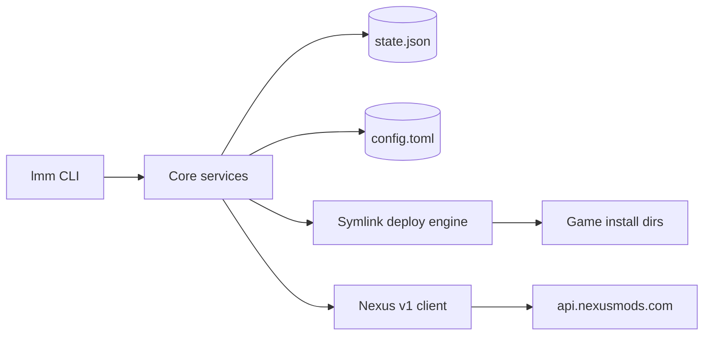

# Linux Mod Manager (lmm)

Build and maintain `lmm`: a personal, config-driven mod manager for Linux games.
It evolves the original `stow_mods` bash script (symlinking a mod tree into a
game's install directory) into a robust Python CLI with a local state file and
Nexus Mods version-update checking.

## Locked decisions

- Language: Python 3.11+ (uses stdlib `tomllib`).
- Interface: CLI subcommands, binary name `lmm`.
- Deployment: symlinks, stow-like, every created link recorded so removal is exact and safe.
- Nexus: free account, check-only. No downloads via API. Local state file is the source of truth and works offline.
- Games: config-driven per-game profiles. Each game has a **default deploy target** (`targets[0]`), **deploy layout** (`flat`, `mod_subdir`, or `mirror`), and **default library subpath**; per-mod `target` overrides deploy dir for exceptions only. Proton/Wine prefix mapping is deferred.

## When working in this project

1. Read this file first, then the relevant reference:
   - System design, modules, config + state schemas: [architecture.md](architecture.md)
   - Nexus API endpoints, auth, rate limits, version check, md5 identify: [nexus-api.md](nexus-api.md)
   - Phased milestones and acceptance criteria: [roadmap.md](roadmap.md)
2. Respect the locked decisions above. If a decision must change, update the skill files in the same change.
3. Build in roadmap phase order (P1 -> P4). Do not start a later phase before earlier acceptance criteria pass.
4. Keep the state file backward compatible: add fields, do not repurpose existing ones; bump `schema_version` on breaking changes and provide a migration.

## Component overview



## CLI surface

Global options: `--config PATH`, `--dry-run`, `--json`, `--verbose`.

| Command | Purpose |
|---------|---------|
| `lmm game add <id> --domain <nexus_domain> --target <path> [--target ...] [--library-subpath PATH] [--deploy-layout flat\|mod_subdir\|mirror]` | Register a game profile; first `--target` is the default deploy dir |
| `lmm game list` | List configured game profiles |
| `lmm game target add <id> --target <path> [--target ...]` | Append deploy target(s) to an existing game profile |
| `lmm game target list <id>` | List deploy targets with indices for `--target-index` |
| `lmm game target remove <id> --index <n> [--index ...]` | Remove secondary deploy target(s); index 0 cannot be removed |
| `lmm add <name_or_path> --game <id> [--mod-id N] [--name NAME] [--move] [--all] [--target-index N \| --target-path PATH]` | Import/register a mod; bare name resolves under game's library dir (P2); `--all` imports each immediate subdirectory from a staging dir |
| `lmm list [game]` | List mods (name, game, version, enabled, deployed) |
| `lmm enable <mod>` / `lmm disable <mod>` | Toggle whether a mod deploys (run `deploy` afterward to apply) |
| `lmm deploy <game>` | Reconcile game dir: remove disabled mods' links, symlink enabled mods |
| `lmm undeploy <game> [--yes]` | Remove only the symlinks recorded in state |
| `lmm remove <mod> [--yes] [--delete-files]` | Unregister mod from state; undeploy links first |
| `lmm doctor` | Validate config, paths, and mod setup |
| `lmm identify <game>` | md5_search local files -> Nexus mod_id/version, fill state |
| `lmm check <game>` | Compare installed version vs Nexus latest; report updates (no download) |

Conventions: a mod is referenced by its `name` (unique within a game) or `game/name`. `deploy` exits 1 on conflicts; `undeploy`/`remove` prompt on TTY unless `--yes`. `--dry-run` prints planned actions without filesystem, network, or state writes (including `identify`/`check`). `identify` exits 1 on API failures or unmatched mods; partial Nexus state is saved.

## Tech stack

- HTTP: `httpx` (preferred) or `requests`.
- CLI framework: `typer` (preferred) or `click`.
- Models/validation: `pydantic` v2.
- Config: stdlib `tomllib` to read, `tomli-w` to write.
- Output: `rich` (tables, status).
- Packaging: `pyproject.toml` with a `lmm` console entry point.

## Key invariants

- Never write into a game directory except as a symlink recorded in state.
- `undeploy` must only remove links present in `deployed_links`; never delete real game files.
- CryEngine / per-mod-folder games (KCD1, KCD2, Stalker 2) require `deploy_layout = "mod_subdir"`.
- Detect conflicts before linking: if a target path exists and is not an lmm-owned symlink, abort that link and report it.
- Nexus API key comes from `NEXUS_API_KEY` env or `config.toml`; never log or commit it.
- `library_root` comes from `LMM_LIBRARY_ROOT` env or `config.toml`; set before first `game add` if not using the default.
- Cache Nexus responses and stay within rate limits (see [nexus-api.md](nexus-api.md)).

## Tooling & conventions

- Formatting + linting: `ruff` for Python (use `ruff format` and `ruff check`; do not add black/isort/flake8). `taplo` for TOML (`pyproject.toml`, `config.toml`). `prettier` optional for Markdown/JSON/YAML.
- Type checking: `ty` (Astral) or `mypy`/`pyright`. Type-annotate public functions and all pydantic models.
- Tests: `pytest`. Map `roadmap.md` acceptance criteria to tests; use temp dirs/`tmp_path` for filesystem and a mocked Nexus client for network.
- Run tools locally as needed; no pre-commit hooks. CI is enforced via GitHub Actions workflows that run lint (ruff, taplo) and tests (pytest) on PRs.
- Dependency locking: `pip-tools`. Source: `requirements.in` / `requirements-dev.in`; lockfiles: `requirements.txt` / `requirements-dev.txt`. After changing `pyproject.toml`, run `pip-compile` on both `.in` files and commit the updated `.txt` files. CI installs from `requirements-dev.txt`.
- Keep `ruff`/`taplo` config in `pyproject.toml` (and `taplo.toml` if needed) so local and CI runs match.

## Project layout (target)

```
linux-mod-manager/
├── pyproject.toml
├── requirements.in          # runtime dep intent (-e .)
├── requirements.txt         # pinned runtime lock (pip-compile)
├── requirements-dev.in      # dev dep intent (-e .[dev])
├── requirements-dev.txt     # pinned dev lock (pip-compile)
├── README.md
├── .github/workflows/   # CI: lint (ruff, taplo) + test (pytest) on PRs
├── tests/
└── src/lmm/
    ├── __init__.py
    ├── cli.py            # typer app, subcommands
    ├── config.py         # load/save config.toml, profiles
    ├── state.py          # state.json load/save, models, migrations
    ├── library.py        # import/list mods
    ├── deploy.py         # symlink engine, conflict detection
    ├── doctor.py         # setup validation
    └── nexus/
        ├── client.py     # v1 REST client, auth, rate limit, cache
        └── updates.py    # version compare, md5 identify
```
