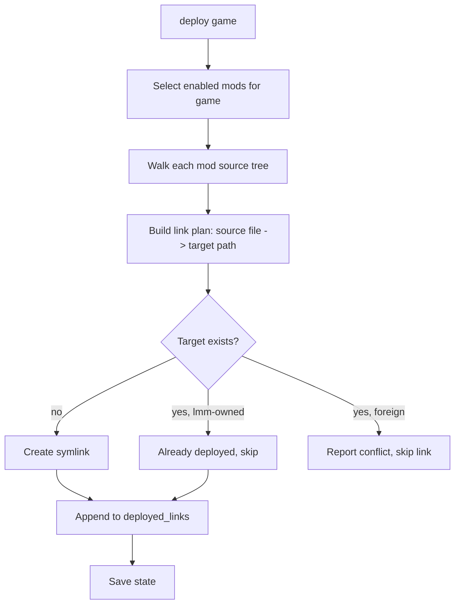

# Architecture

Detailed design for `lmm`. Read [SKILL.md](SKILL.md) first.

## Modules

| Module | Responsibility |
|--------|----------------|
| `cli.py` | Typer app; parses args, wires services, formats output via rich. No business logic. |
| `config.py` | Read/write `config.toml`; resolve paths; expose `GameProfile` objects; resolve API key from env or file. |
| `state.py` | Load/save `state.json`; pydantic models; `schema_version`; migrations. |
| `library.py` | Import a mod (dir or archive) into `library_root`; list mods; resolve mod references (`name` or `game/name`). |
| `deploy.py` | Symlink engine: plan, conflict-check, create, record, remove. |
| `nexus/client.py` | v1 REST client: auth header, retry/backoff, rate-limit accounting, on-disk response cache. |
| `nexus/updates.py` | Version comparison and md5 identify, mapping local files to Nexus mod/version. |

Dependency direction: `cli` -> services (`config`, `state`, `library`, `deploy`, `nexus`). Services do not import `cli`. `deploy` and `nexus` depend on `state`/`config` models only.

## Config schema (`~/.config/lmm/config.toml`)

```toml
schema_version = 1
# Override with your mod storage location (e.g. ~/Games/StowMods/Mods).
library_root = "/home/user/.local/share/lmm/mods"
# API key: prefer NEXUS_API_KEY env var; this is a fallback.
nexus_api_key = ""

[games.kcd2]
nexus_domain = "kingdomcomedeliverance2"
# One or more deploy targets. Mods link into the first target unless overridden.
targets = ["/home/aapoko/Games/SteamLibrary/steamapps/common/KingdomComeDeliverance2/Mods"]
deploy_method = "symlink"

[games.oblivionremastered]
nexus_domain = "oblivionremastered"
targets = [
  "/home/aapoko/Games/SteamLibrary/steamapps/common/Oblivion Remastered/OblivionRemastered/Content/Paks/~mods",
  "/home/aapoko/Games/SteamLibrary/steamapps/common/Oblivion Remastered/OblivionRemastered/Binaries/Win64",
]
deploy_method = "symlink"
```

Notes:
- Resolution order for the API key: `NEXUS_API_KEY` env var, then `nexus_api_key` in config. Never log it.
- `targets` is ordered; index 0 is the default. A mod can pin a different target by index or absolute path (see state `target`).
- Paths may contain spaces; always quote/escape and use `pathlib.Path`, never shell string concatenation.

## State schema (`~/.local/share/lmm/state.json`)

```json
{
  "schema_version": 1,
  "mods": [
    {
      "name": "easysharpening",
      "game": "kcd2",
      "source_path": "/home/aapoko/Games/StowMods/Mods/KingdomComeDeliverance2/Mods/easysharpening",
      "enabled": true,
      "target": null,
      "nexus_mod_id": null,
      "file_id": null,
      "installed_version": null,
      "file_md5": null,
      "deployed_links": [],
      "last_checked": null,
      "update_available": false,
      "latest_version": null
    }
  ]
}
```

Field semantics:
- `name`: unique per `game`. Mod reference is `name` or `game/name`.
- `source_path`: canonical location of the mod inside `library_root`.
- `target`: optional override. `null` = use game profile target index 0; integer = target index; string = absolute path.
- `nexus_mod_id` / `file_id` / `installed_version` / `file_md5`: filled by `add --mod-id` or `identify`.
- `deployed_links`: list of `{link, source}` absolute-path pairs lmm created. Authoritative for `undeploy`.
- `last_checked`, `update_available`, `latest_version`: populated by `check`.

Migrations: read `schema_version`; if older, run ordered migration functions and rewrite. Adding optional fields is non-breaking and does not require a bump.

## Symlink deploy engine (`deploy.py`)

Mirrors the original `stow_mods` behavior (`stow -R` add / `stow -D` remove) but records every link.

### Deploy flow



Rules:
- Resolve the mod's target: explicit `target`, else profile `targets[0]`.
- For each file under the mod source, compute the relative path and link it at `target/relpath`. Create parent dirs as real directories when needed (record created dirs so empty ones can be cleaned on undeploy). Prefer file-level links so multiple mods can share a directory.
- Conflict detection before creating any link:
  - Path free -> create link, record it.
  - Path is a symlink lmm created (in `deployed_links`) -> idempotent, skip.
  - Path exists and is a real file/dir or a foreign symlink -> conflict; do not overwrite; collect and report at the end.
- `--dry-run`: print the plan, change nothing.

### Undeploy flow

- Iterate only `deployed_links` for the game's mods.
- Remove each link if it still points to the recorded source; if changed/missing, warn and skip (never delete real files).
- Remove now-empty directories that lmm created.
- Clear `deployed_links` for affected mods; save state.

`enable`/`disable` set the `enabled` flag; they do not touch the filesystem until the next `deploy`/`undeploy`.

## Multi-target and per-mod overrides

- Some games need different files in different locations (e.g. pak files in a `~mods` folder, DLLs/ASI loaders in a binaries folder). Profiles hold ordered `targets`; a mod sets `target` to choose.
- A future enhancement: per-mod, per-subpath routing rules. Keep the data model open (the `target` field can later become a structured object) but implement only single-target-per-mod now.

## Error handling

- Fail loudly on: missing game profile, unreadable library root, foreign-file conflicts.
- Degrade gracefully on: missing/changed links during undeploy, Nexus network/rate-limit errors during `check`/`identify` (report and continue).
- All filesystem mutations honor `--dry-run`.
