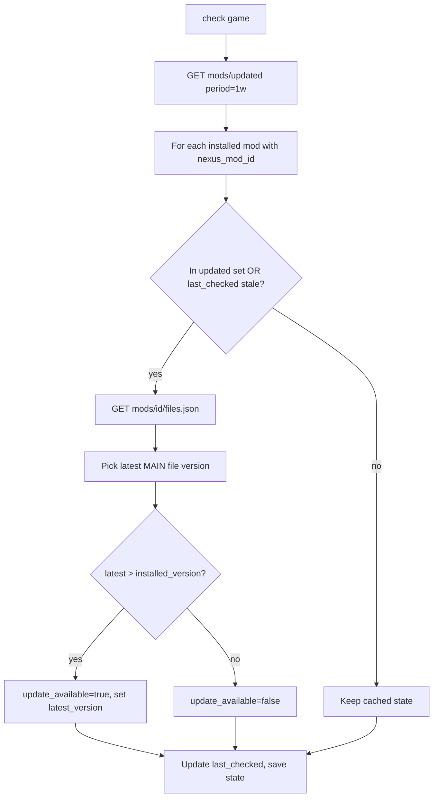

# Nexus Mods API

Reference for the `nexus/` modules. Free account, check-only. Read [SKILL.md](SKILL.md) first.

## Authentication

- Personal API key: Nexus site -> account settings -> API Access page. Allowed for personal/testing use under the API Acceptable Use Policy.
- Key resolution: `NEXUS_API_KEY` env var first, then `nexus_api_key` in `config.toml`.
- Every request sends the header `apikey: <key>`. Send a descriptive `User-Agent` (e.g. `lmm/<version>`).
- Never log, print, or commit the key. Mask it in verbose output.

## Base and endpoints (v1 REST)

Base URL: `https://api.nexusmods.com`. Responses are JSON. `{game}` is the Nexus domain name (e.g. `kingdomcomedeliverance2`).

| Endpoint | Use in lmm |
|----------|------------|
| `GET /v1/users/validate.json` | Validate the API key, confirm account + premium flag |
| `GET /v1/games/{game}/mods/{id}.json` | Mod metadata, includes current `version` |
| `GET /v1/games/{game}/mods/{id}/files.json` | File list with `file_id`, `version`, `category` (look for `MAIN`/latest) |
| `GET /v1/games/{game}/mods/{id}/files/{file_id}.json` | Single file detail |
| `GET /v1/games/{game}/mods/updated.json?period=1w` | Mod IDs updated in `1d`/`1w`/`1m`; cheap batch pre-filter |
| `GET /v1/games/{game}/mods/md5_search/{md5}.json` | Identify a local file by hash -> mod_id, file_id, version |
| `GET /v1/user/tracked_mods.json` | Mods the user tracks on Nexus (optional import source) |

## Rate limits

- Roughly 2500 requests/day and 100/hour per key. Responses include `X-RL-*` headers (hourly/daily remaining and reset); read them and back off as they approach zero.
- Strategy:
  1. Call `mods/updated.json?period=...` once per game to get the set of recently changed mod IDs.
  2. Only fetch `mods/{id}` / `files.json` detail for installed mods whose ID appears in that set, or whose `last_checked` is stale.
  3. Cache all responses on disk (e.g. `~/.cache/lmm/nexus/`) with a TTL; serve from cache within TTL.
- Use exponential backoff with jitter on HTTP 429 and 5xx. Treat 401/403 as a bad/expired key and stop.

## Version check flow (`check`)

- Version comparison: prefer semantic comparison; fall back to string inequality when versions are non-semver. Record both `installed_version` and `latest_version` so the report is meaningful even when comparison is fuzzy.
- Output: a table of mods with updates (name, installed -> latest). No files are downloaded.

## md5 identify flow (`identify`)

- For each installed mod missing `nexus_mod_id`, compute the MD5 of its primary archive/file and call `md5_search/{md5}.json`.
- The endpoint can return multiple matches; disambiguate by file size and game domain. Store `nexus_mod_id`, `file_id`, `installed_version`, `file_md5` in state.
- Hash large files in chunks; cache the computed md5 in state to avoid recomputation.

## Downloads: free vs premium

- Free accounts cannot generate direct download links via the API. lmm is check-only: it reports updates and links the user to the mod page.
- Future options (out of scope now, keep design open):
  - `nxm://` handler: register lmm as the handler so the site's "Mod Manager Download" button hands a URL to lmm.
  - Premium auto-download: `GET /v1/games/{game}/mods/{id}/files/{file_id}/download_link.json` returns CDN links for premium users.

## v2 GraphQL (optional, later)

- Endpoint: `https://api.nexusmods.com/v2/graphql`. Mostly unauthenticated for metadata; some fields need an OAuth token.
- Useful for richer queries (file contents search, batched metadata). Not required for the check-only MVP; prefer v1 REST for P3.
